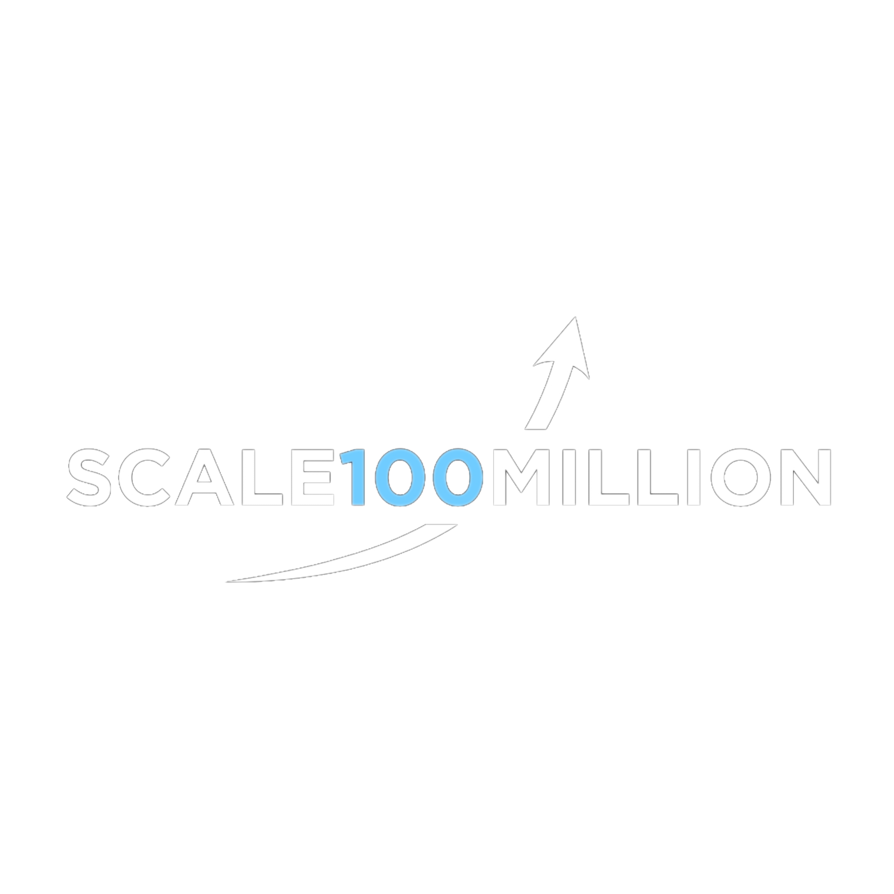

  
   
   

  <h1><b>🚀 SCALE 100 MILLION</b></h1>
  
<b><i>The Engine Behind Growing Online Businesses.</i></b>

  

    
    
    
    
  

  

    <a href="#-core-modules">Core Modules</a> •
    <a href="#-stack">Tech Stack</a> •
    <a href="#-local-setup">Setup</a>
  

---

## 🏛️ OVERVIEW

**Scale 100 Million** is a premium, high-impact growth consulting website tailored for digital agencies and mentorship models. Designed with deep dark mode aesthetics, dynamic spotlight triggers, and smooth spatial scrolling structures, it represents a high-end interface for navigating elite products and AI-driven growth systems.

---

## 🧩 CORE MODULES

To offer an immersive user experience, the system is segmented into the following high-performing operational channels:

<table align="center">
  <tr>
    <td width="50%">
      <h3>🤖 AI Automation Services</h3>
      
Automated workflow frameworks, integration nodes, and modular bots configured to streamline modern workflows and increase operational efficiency.

    </td>
    <td width="50%">
      <h3>👑 Founder Club Mentorship</h3>
      
High-priority networking modules with structured pipeline mentorship channels and tailored products designed to facilitate business scaling.

    </td>
  </tr>
  <tr>
    <td>
      <h3>📈 Growth Engine Overhaul</h3>
      
Consulting interface mapping that translates manual pipelines into automated growth filters, scaling content visibility and delivery rates.

    </td>
    <td>
      <h3>🎥 Dynamic Media Space</h3>
      
An interactive, responsive media layout optimizing animation offsets for high-performance responsive streaming directly on modern viewports.

    </td>
  </tr>
</table>

---

## 🛠️ THE VISUAL STACK

The interface utilizes a modern, optimized layout ecosystem consisting of high-density React hooks and lightweight framings.

-   **Frontend**: `React 19` styled with a fluid single-page router interface (`React Router Dom`).
-   **Bundler Tooling**: `Vite` serving incredibly lightweight builds for highly optimized page loaders.
-   **Styling & FX**: `Tailwind CSS`, incorporating continuous mouse-tracking gradients and structured backdrops.
-   **Animation Nodes**: `Framer Motion` coordinating fluid viewport fades alongside continuous intersect-observer smooth triggers.
-   **Structure Fluidity**: `Lenis` coordinate systems facilitating edge-to-edge smooth spatial scrolling.

---

  
Designed with ❤️ for premium modern user frameworks.

